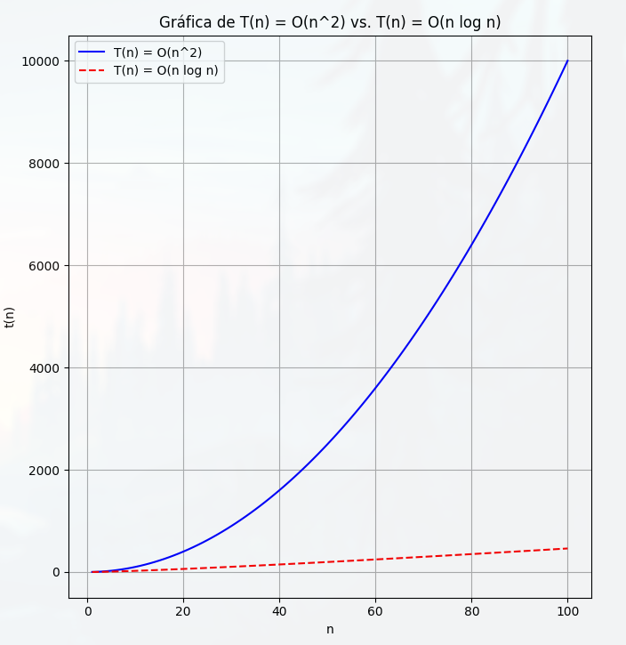
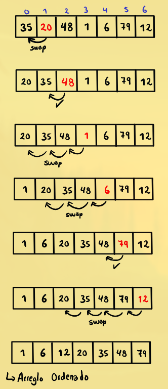
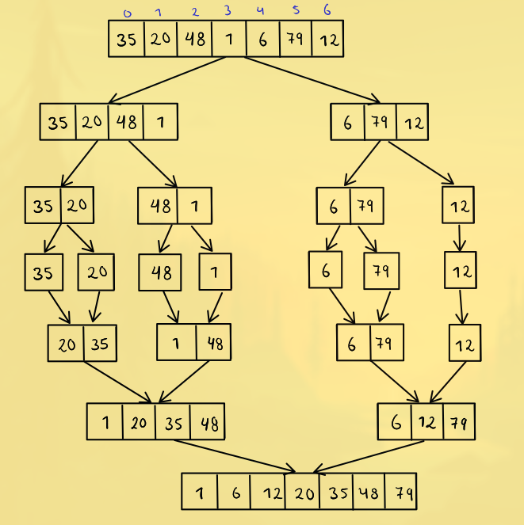

## Práctica 1: Merge Sort vs Insertion Sort

## Comparación en Python de sus tiempos de complejidad

## Rendimiento en Conjuntos de Datos Pequeños

- Insertion Sort es eficiente en conjuntos de datos pequeños y suele superar a Merge
Sort en términos de tiempo de ejecución en estos casos.
- Merge Sort tiende a ser menos eficiente en conjuntos de datos pequeños debido a
su mayor sobrecarga en la división y fusión de subarreglos.

## Eficiencia en la Combinación de Grandes Conjuntos

- Merge Sort es especialmente eficiente en la combinación de dos conjuntos de datos
grandes y ordenados en uno solo. Esta capacidad para fusionar eficientemente
conjuntos grandes lo convierte en una elección sólida para conjuntos de datos
extensos.

## Implementación y Facilidad de Codificación

- Insertion Sort es más fácil de codificar y entender, lo que lo hace adecuado para
situaciones en las que la simplicidad es una prioridad.
- Merge Sort suele ser más complicado de implementar en comparación con Insertion
Sort debido a su división y fusión recursiva.

## Ejemplo

### Solución Insertion Sort

### Solución Merge Sort

